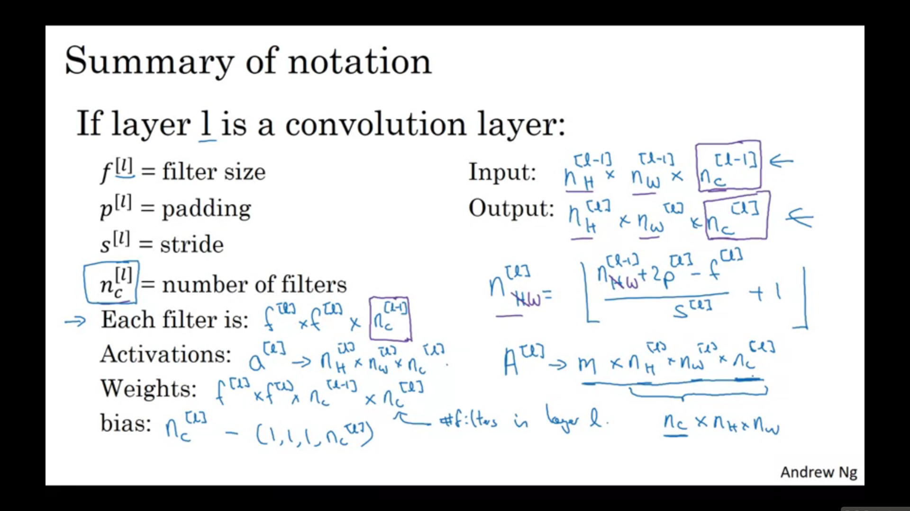
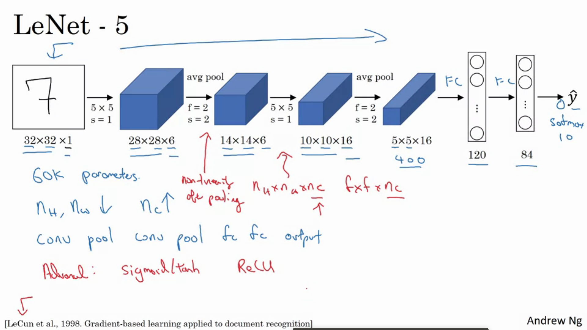
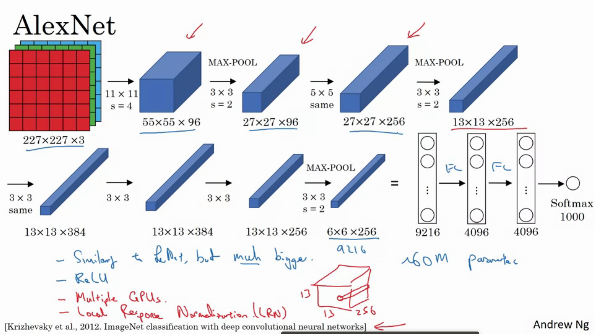
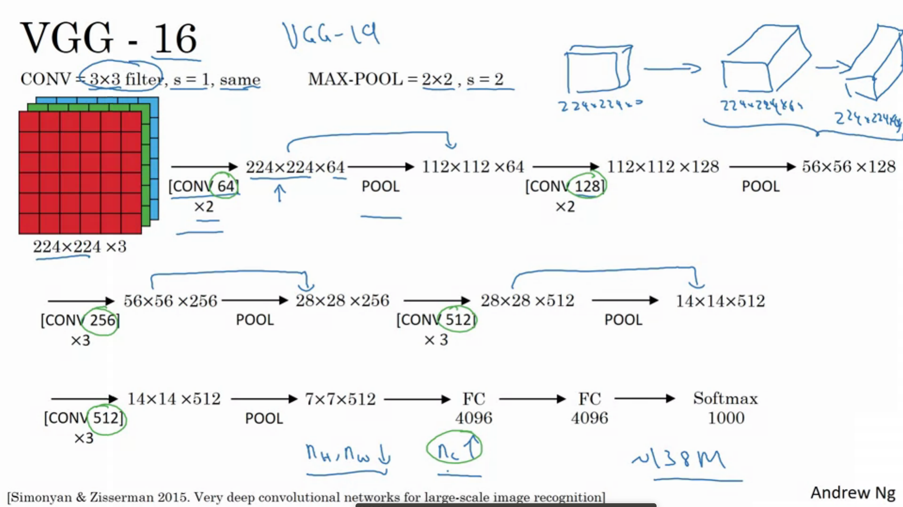
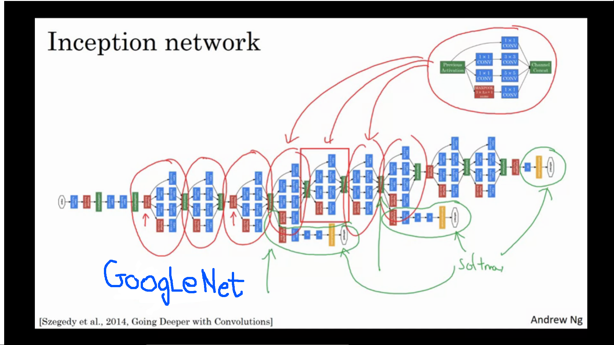

# Convolutional Neural Networks:
## Week 1:
### Convolution:

<caption>
 <u>  **Figure 2** </u>  : **Convolution operation** 

* Filters are usually odd.
	1. Even filters cause some asymmetry(more to the left or more towards the right).
	2. For odd filters, we can talk about a central position of the filter.

### Edge Detection:
* Vertical Edge Detection Filter:
<table>
	<tr>
		<td>1</td>
		<td>0</td>
		<td>-1</td>
	</tr>
	<tr>
		<td>1</td>
		<td>0</td>
		<td>-1</td>
	</tr>
	<tr>
		<td>1</td>
		<td>0</td>
		<td>-1</td>
	</tr>
</table>

* Sobel Vertical Edge Detection Filter:
<table>
	<tr>
		<td>1</td>
		<td>0</td>
		<td>-1</td>
	</tr>
	<tr>
		<td>2</td>
		<td>0</td>
		<td>-2</td>
	</tr>
	<tr>
		<td>1</td>
		<td>0</td>
		<td>-1</td>
	</tr>
</table>

* Scharr Vertical Edge Detection Filter:
<table>
	<tr>
		<td>3</td>
		<td>0</td>
		<td>-3</td>
	</tr>
	<tr>
		<td>10</td>
		<td>0</td>
		<td>-10</td>
	</tr>
	<tr>
		<td>3</td>
		<td>0</td>
		<td>-3</td>
	</tr>
</table>

* Horizontal Edge Detection Filter:
<table>
	<tr>
		<td>1</td>
		<td>1</td>
		<td>1</td>
	</tr>
	<tr>
		<td>0</td>
		<td>0</td>
		<td>0</td>
	</tr>
	<tr>
		<td>-1</td>
		<td>-1</td>
		<td>-1</td>
	</tr>
</table>

* These are not the only possible filters, a NN can also learn the filter to give something better than these/ can learn an edge detector which can detect an edge at angle of 30 degrees or any other angle.

### Padding:
Need for padding:
* Each convolution decreases the size of the image.
* THe pixels in the corners/ edges are used much less number of times than that i the middle, thus we are losing a lot of information those piixels provide.

### Types of Convolution:
* Valid Convolution: Convolution without the use of padding.
* Same Convolution: Convolution using as much padding so as to keep the dimensions constant. For n x n images, f x f filters, the amount of padding is given by p = (f-1)/2.

### Strided Convolution
* When we do the convolutions, instead of shifting the filter by 1 to the right or downwards, we shift it by 's' where 's' is the Stride.
* Size of output layer when we convolve n x n using an f x f filter, where we have done a padding of p, and we use a stride ,Output dimension is: 
**(floor((n+2p-f)/s) +1,floor((n+2p-f)/s) +1)**

### 3D Convolution:
* If along with hieght and width, we also had number of channels, then we would have to have the same number of channels in the filters.
* 2D convolution of corresponding layers and its addition(over the layers) would give a 2D layer as the output.
* By using multiple 3D filters we can get a thickness at the output. The number of channels of the output would be equal to the number of filters used. 

### Notation:
 

* Note: Generally CNN start with a higher value of n_h and n_w, which gradually decreases as we go deeper in the CNN. On the other hand n_c would start with 3(due to 3 channels RGB) and would increases as we go deeper.

### Pooling:
#### Maxpool:
* Convolution(2D) with respect to filters which take the maximum from the set of neurons which is being convoluted with the filter in each step of convolution.
* Generally there is no padding done for pooling.
* Output layer has dimensions given by (floor((n+2p-f)/s) +1,floor((n+2p-f)/s) +1,n_c) where n_c is the number of channels in the input layer.

#### Average pool:
* Convolution(2D) with respect to filters which take the average of the set of neurons which is being convoluted with the filter in each step of convolution.
* Very rarely used.

### Advantages of Convolution:
* Parameter Sharing: A feature detector(like a vertical edge detector) that is useful in one part of the image is probably useful in the other parts of the image as well.
* Sparsity of connections: Each activation in the next layer depends only on a small number of activations from the previous layer
* Since we use lesser number of parameters when we are convolving, it has a lesser chance of overfitting.

### LeNet-5
 

### AlexNet

### VGG-16

* They made the strides, filter size and the pooling layers constant, this caused
* Keeping the rate at which the length/width of the layers go down and the rate at which the depth of each layer goes up constant was a good feature in VGG net.

### ResNet:
* Take the activations of layer 'l' and add it to the logits of the layer 'l+2'.
* ResNets are not affected by exploding and vanishing gradients.
* Let the activation function be g(z) be a ReLU activation function.
* Now, a[l+2] = g(z[l+2]+a[l])
* a[l+2] = g(W[l+1]a[l+1]+b[l]+a[l])
* If we have used L2 regularisation, then W would be small. This can cause the problem of vanishing gradients. Assuming W and b to be small, we get a[l+2] = g(a[l]) = a[l].
* This would cause the two layers to learn an identity function. Thus it is easy for these two layers to learn the identity function. Thus we can say that they can not hurt NN.
* If we have difference in the dimensions of a[l] and z[l+2], we multiply a new matrix 'Ws' to a[l] to bring it to the same dimension of z[l+2]. 
* Ws can be learnable parameters or they can be fixed matrices which can be to just provide a zero padding.

### Networks in Netwroks:
* Means using a 1 x 1 filter for convolution before taking ReLU activation
* It is like a neuron which takes input as all the neurons in one position across the depth.
* If we have multiple such filters then it is like a densely connected layer, just that they are for corresponding positions of the filters.
* This is used to reduce the depth.
* Dimensionally, these only affect the number of channels.

### Inception Network:
* Use of Bottle-neck layers to bring down the computation cost.
* Bottle neck layer implies using a 1 x 1 filter, so as to bring down the number of channels in the input. Then use of the filter to do a normal convolution(now since the depth is reduced, it is much less computationally expensive).

#### Inception Module:
 

#### Inception Network:
 

### Transfer Learning:
* Using a pretrained network as a basic model and train from there. Also inherit the hyperparameters. 
<ol>
	<li>If we have very less data, we can just fix the initial layers, and just train the last layer(softmax layer) after changing it to give the required set of classes. Just train the weights f the last layer keeping the layersbefore it freezed.</li>
	<li>If we have a medium sized data set then we can just train the last few layers and keep the first few layers fixed.</li>
	<li>If we have a large enough data set then we can just initialise the weights to the pre-trained network and update all the layers in the network.</li>
</ol>

### Data Augmentation:
* Used to increase the size of data set.
* Can be done by various methods like mirror image of the original image, random cropping(reasonably large cropped image), colour shifting. Other less frequently used methods are rotating image, shearing image, local warping.

### State of Computer Vision in Deep Learning:
* Image recognition is has large amount of data but since the problem of computer vision is very complex, this data is still much less.
* Objection detection has even lesser amount of data than image detection.
* When we have lots of data(wrt problem at hand), people use simpler algorithms and lesser hand engineering.
* When we have lesser amount of data(wrt problem at hand), people use more hand engineering.
* Hand engineering is designing the features, network arhitecture or other components.
* Hand engineering in practise requires a good insight 
* The NN has 2 sources of knowledge:
	1. Labelled data
	2. Hand-engineering
* Transfer learning helps a lot.

### Tips for doing well on Benchmarks/Competitions:
#### Ensembling :
* Train several networks independently and average their outputs.
* Ensembling increases running time and thus it is very rarely used to serve customers.
* One disadvantage is since we have 10-15 NN it takes a lot of space and slows down.

#### Multi-crop :
* Run classifier on multiple versions of test images and average results.
* 10-crop is a common method for Multi-crop. (1 centre crop, and 4 for each corner, and similar 5 more crops for the mirror image).

### General Tips:
* Use architecture of Networks published in the literature.
* Use open source implementations if possible
* Use pretrained models and fine tune on your dataset